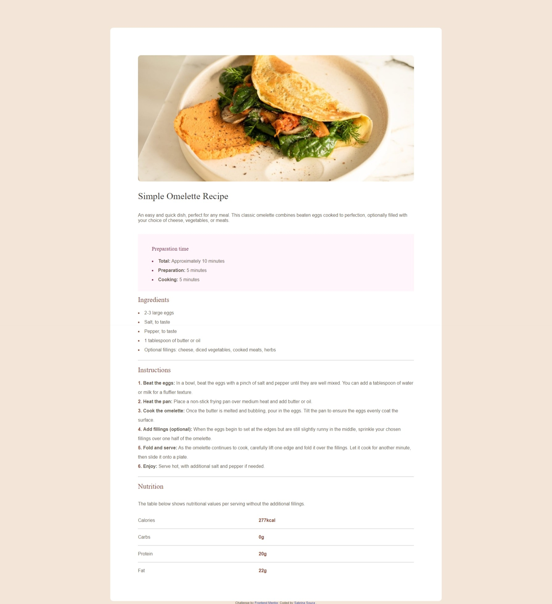

# LandingPage_Challenger

This is a solution to the [Recipe page challenge on Frontend Mentor](https://www.frontendmentor.io/challenges/recipe-page-KiTsR8QQKm). Frontend Mentor challenges help you improve your coding skills by building realistic projects. 

## Table of contents

- [Overview](#overview)
  - [Screenshot](#screenshot)
  - [Links](#links)
  - [Built with](#built-with)
  - [Continued development](#continued-development)
- [Author](#author)

## Overview

### Screenshot

### Links

- Live Site URL: [Simple Omelette Recipe](https://landing-page-challenger-nine.vercel.app/)

### Built with

- HTML
- CSS custom properties
- Flexbox
- Mobile-first workflow

### Continued development

This challenge was great for testing my knowledge of HTML and CSS, I intend to continue perfecting myself and learning new techniques.

## Author

- Website - [Shortly](https://)
